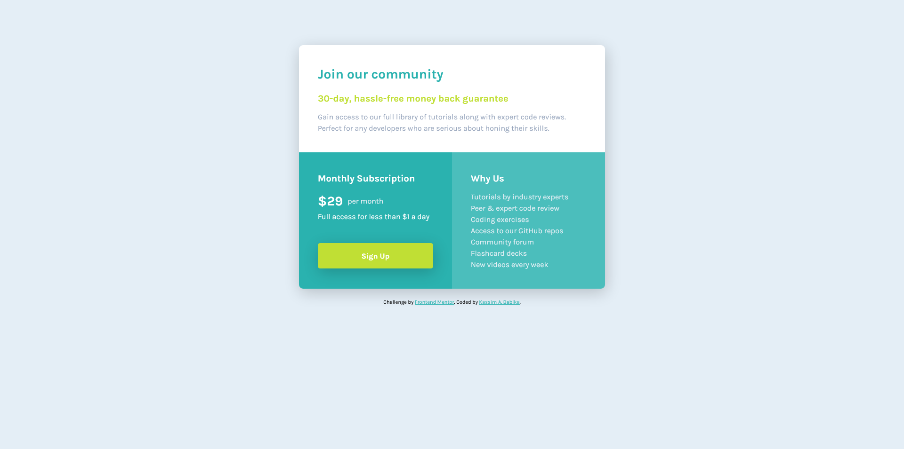
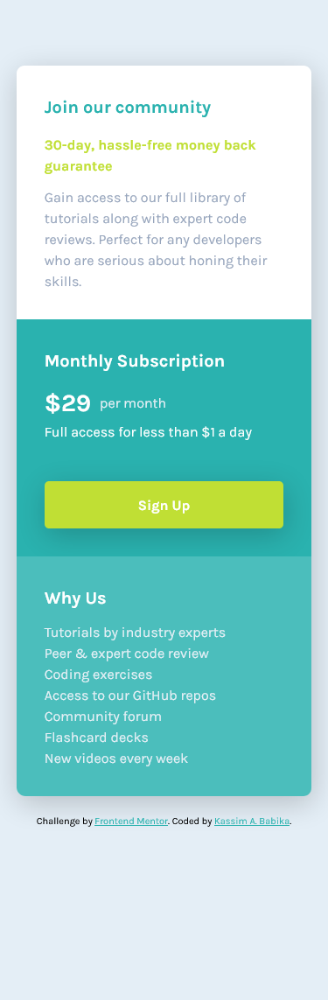

# Frontend Mentor - Single price grid component solution

This is a solution to the [Single price grid component challenge on Frontend Mentor](https://www.frontendmentor.io/challenges/single-price-grid-component-5ce41129d0ff452fec5abbbc). Frontend Mentor challenges help you improve your coding skills by building realistic projects.

## Table of contents

- [Overview](#overview)
  - [The challenge](#the-challenge)
  - [Screenshot](#screenshot)
  - [Links](#links)
- [My process](#my-process)
  - [Built with](#built-with)
  - [What I learned](#what-i-learned)
  - [Continued development](#continued-development)
  - [Useful resources](#useful-resources)
- [Author](#author)
- [Acknowledgments](#acknowledgments)

---

## Overview

### The challenge

Users should be able to:

- View the optimal layout for the component depending on their device's screen size
- See a hover state on desktop for the Sign Up call-to-action

### Screenshot




### Links

- Solution URL: [GitHub Repository](https://github.com/kassimbabika/fem-single-price-grid-component)
- Live Site URL: [GitHub Pages Live Site](https://kassimbabika.github.io/fem-single-price-grid-component/)

---

## My process

My Process? ...Did I have one?

I don't know if I had much of a "process" to be honest.

I've dabbled with front end development before now but that's it - keyword: "dabbled". I never really went past following basic tutorials. For persective, the last time I dipped my toes in front end was when the Brackets editor had just been released...so a good 8 or 9 years ago!

This is the first time I'm actually creating something on my own with nothng but an image of the finished design, challenge brief and the help of the interwebs on the bits I couldn't figure out or that kept breaking.

I wrote the basic markup and going from my most recent deep dive into basic HTML & CSS in the last 3 weeks, I started on the CSS and it was certainly an eye opener doing my own project (however small or simple it is) just how many ways different things can break in different ways. And not even just the code.

I mean...wow!

So, yeah - I would write up a bit of CSS and check how it compared to the target design and tweak it until I couldn't tweak anymore (probably wasted a good 50% of the 9-10 hours total that it took me to get this here just trying to match the design with no Sketch/Figma design file). Given my absolutely festidious nature when it comes to what feels like OCD at this point, I could barely let it go.

But, I digress...

When I did encouter problems like why the border radius on my container wasn't what I was expecting to see (as the child element didn't have one..then didn't have the **right** one as I later found out), first place I went was of course Google and invariably the MDN Documentation as I just prefer how they do things compared to the others.

And when I could quite figure it out on my own, it was back to Google for a more specific query which usually led to Stack Overflow or a helpful article or two thousand. The trick trying to find the articles that would help me in the way I would undersand best as there are soo many resoources for just about any topic.

So, once I did find a solution (or the beginnings of one), it was then time to fight with CSS again in order to implent it in the right way and not break something else in the process.

Looking back, the journey of discovery on the various bits I just couldn't figure out was actually fun and certainly felt rewarding whe I finally manage to create something that didn't stink and could achieve what I set out to achieve.

Anyhow, long story short: it's been a hell of a ride...one I am hopeing to continue with. The plan right now is to attempt as many Front End Mentor (Free) challenges as i can over the coming months and hopefully develop this into something more than just 'watch tutorial, follow tutorial, don't follow up with anything custome, rinse/repeat'.

Kass

---

### Built with

- Semantic HTML5 markup
- CSS custom properties
- Flexbox
- CSS Grid
- Mobile-first workflow
- Using the frankly astonishingly brilliant Microsoft VS Code augmented with the built-in Emmet and the Live Server extension - how all this is free is just beyond belief! We really haven't got it any easier or better to start coding than right now...

### What I learned

What didn't I learn?! Eveno though I was familiar with basic HTML and CSS, it still felt like I didn't really know anything on how all the have to come together and work harmonisously, especially when it comes to the more "intermediate" stuff like border radius, box shadows, media queries and of course grid.

I'm not afraid to admit that even that button gave me no end of nightmare fuel trying to make it look and work right while enclosing the anchor tag in it. It was really hard trying to figure out which element or class to target and for what purpose in order to make sure that the **whole** button was clickable and not just the anchor element within it.

I believe that the default button styles are what tripped me up for the most part and trying to manipulate that area to try to match the brief was beyond frustrating: it just felt like it was determined to no do anything I wanted it to most of the time.

Painful.

I finally managed to get it to a point where it at least looks about right but, I am sure that there was a easier/better way/shorter to code way of getting the right result. Answers on a postcard please. Given the number of buttons on the internet exceeds a few trilliaons, I have a feeling this is an important part ot master.

As for the border radii (where I just applied it to the right class/element at the right resolution which feels simplistic), box shadows (which are still not exactly right to my eye) and media queries (which may not quite be the best way to achieve the right result), I've certainly learned a thing or two there.

There's not much code I can honestly point to and say "I'm proud of that" since it's nothing absolutely amazing but, I do hope to improve moving forward.

Although this bit here to ge the "per month" to the right height and spacing relative to the price definitely gave me a chuckle:

```css
.flex {
	display: flex;
	align-items: center;
}
```

Please let me know the actual way of getting the same result!

Finally, a special mention to my implimentation of the grid layout.

It was certainly my biggest headache and although I found a myriad brilliant resources to help there as I list below, it can't possibly be the most efficient way of doing it. (As I started the challenge, I had just watched a video that showed the basics of grip template areas that I believe would've been a good or even better solution but, I just didn't know enough of it to try. That will be for the further development)

---

### Continued development

As I mentioned above, I plan to continue taking on the Front End Mentor challenges over the coming months to develop further, with special areas of focus being grid areas, layouts in general and those god forsaken buttons.

### Useful resources

- [Learn CSS Grid the Easy Way by Kevin Powell](https://www.youtube.com/watch?v=rg7Fvvl3taU) - This was the catalyst for me even trying out the challenges as I felt I had finally unlocked the secret to CSS layouts and could get on the first rung of that lofty ladder. Brilliant video, brilliant content creator. If you want to learn CSS grid, this is your starting point. Highly recommended.

- [Equal CSS Grid Columns on Stack Overflow](https://stackoverflow.com/questions/47601564/equal-width-columns-in-css-grid) - This helped with keeping the content at a consistent size (and not stretch out ad infinitum) and in trying to get the transition at the 725px breakpoint to be less jarring.

- [Sesponsive Grid in 2 minutes by Travis Horn](https://travishorn.com/responsive-grid-in-2-minutes-with-css-grid-layout-4842a41420fe) - it's a shame I saw this too late for this challenge but, what a guide! Great layout, useful content, not too long and clearly explained. Use it

- [Basic Concepts of Grid Layout at Mozilla Developer Network](https://developer.mozilla.org/en-US/docs/Web/CSS/CSS_Grid_Layout/Basic_Concepts_of_Grid_Layout) - I barely scraped the surface of this but, what I did see was brilliant to try to break down the grid concepts. Specifically helped me with grid tracks.

- [Create a Responsive Layout with Grid at W3Docs](https://www.w3docs.com/snippets/css/how-to-create-a-responsive-layout-with-grid.html) - Didn't exactly use this one either as it came in right at the end too but, I know i will be useful for somebody who's just starting out. Short and sweet.

- [Designing Beautiful Shadows in CSS by Josh Comeau](https://www.joshwcomeau.com/css/designing-shadows/) - This one definitely helped me with the shadows. Yes, i knew of the box-shadow property before but the little interactive shadow snippet about a third of the way down the page really helped to bring that to life and improve my understanding of how it really worked. Also, his CSS reset that I had found a couple of weeks back was also pretty solid and used a lot of it as a basis for the one I have here (and hope to use in my projects going forward).

- [CSS Media Queries Examples at W3Schools](https://www.w3schools.com/css/css3_mediaqueries_ex.asp) - A good one for help on media queries. Obviously, MDN and others should have a section like this too but, this is just the first I came across and it answered my question at least.

Plus props to the countless other articles, documentation, stack overflow answers etc etc that I grazed through during this entire ordeal.

---

## Author

- Website - [Kassim Babika](https://kassimbabika.github.io/fem-single-price-grid-component/) (None yet - it's a WIP so, watch this space!)
- Frontend Mentor - [@kassimbabika](https://www.frontendmentor.io/profile/kassimbabika)

## Acknowledgments

Just a general one to the entire flipping web for all the resources I am able to access for absolutely free. Amazing!

Thank you Mozilla for continuously helping improve the internet with the best documentation and browser around (Shut up! I'm not a Firefox fanboy. You are!), Microsoft (I know right!) for the best damn piece of software this side of Office (did I mention is absolutely free?!), Front End Mentor for the challenges, GitHub for the webspace, W3Schools, Kevin Powell (CSS Guru on YouTube), numerous article authors, along with the number of countless, faceless, nameless people on the interwebs sharing your apps, videos, extentions, knowledge and general wisdom (possibly including you. Yes, you...right there!) So, thank you all and I hope this actually leads somewhere this time!

---

P.S I'm **almost** sorry for the long essay here but hey,...it's my fricking project!
